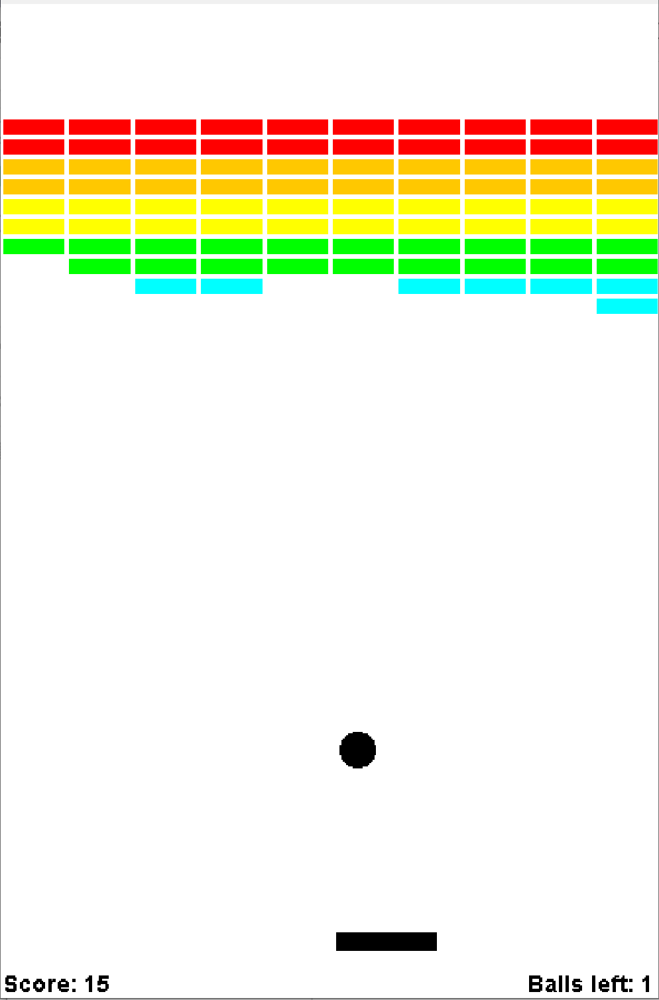

# Breakout Game

This is an implementation of the arcade game [Breakout](https://en.wikipedia.org/wiki/Breakout_(video_game)) coded in Java.

The ACM Java library and `bounce.au` audio clip are sourced from [Stanford Engineering Everywhere - CS106A - Programming Methodology](https://see.stanford.edu/Course/CS106A).

## Instructions
1. Run `javac -cp acm.jar Breakout.java` to compile.
2. For Windows, run `java -cp ".;acm.jar" Breakout` to play the game.  
For Unix, run `java -cp .:acm.jar Breakout`.

## Screenshot of Demo Play

    

